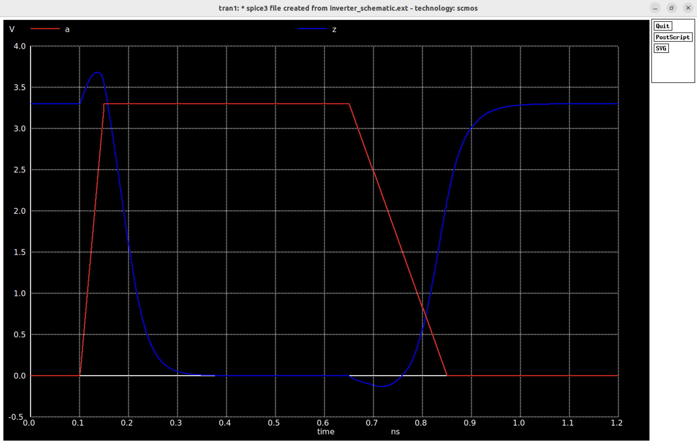

# CMOS Inverter

As the "Hello World" of CMOS VLSI design, this project implements a **CMOS inverter** using open-source tools: Xschem for schematic capture, ngspice for simulation, Magic VLSI for layout, and netgen for LVS verification.

This project walks through the complete flow of schematic → simulation → layout → verification, showcasing a full custom VLSI design from transistor-level design to layout verification.

---

### 🔧 Tools Used

| Tool     | Purpose |
|----------|---------|
| Xschem   | Schematic design |
| ngspice  | Circuit simulation |
| Magic VLSI | Physical layout |
| netgen   | Layout vs. Schematic (LVS) check |

---

### 🧠 Theory

A CMOS inverter is composed of a **PMOS pull-up** and **NMOS pull-down** transistor connected in series between VDD and GND. The gates are tied together as input, and the drains are tied together as output.

| Input | PMOS | NMOS | Output |
|-------|------|------|--------|
| 0     | ON   | OFF  | 1      |
| 1     | OFF  | ON   | 0      |

---

### 📐 Schematic (Xschem)

<p align="center">
  
</p>

- Includes a PMOS and NMOS transistor.
- Uses `.model` definitions for simulation.
- Simulated using ngspice to observe inverter behavior.

---

### 📈 Simulation (ngspice)

<p align="center">
  
</p>

The inverter demonstrates standard logic behavior:
- Low input → high output
- High input → low output

---

### 🧱 Layout (Magic VLSI)

<p align="center">
  
</p>

- Drawn using n-diffusion, p-diffusion, poly, and metal layers.
- DRC clean.
- Extracted netlist used for LVS comparison.

---

### ✅ LVS Check (Netgen)

<p align="center">
  
</p>

- LVS passed: layout matches schematic.
- Confirms that physical implementation correctly represents intended logic.

---

### 🧪 Spice Models

```spice
.model nmos_n01 NMOS (LEVEL=1 VTO=0.7 KP=50u)
.model pmos_p01 PMOS (LEVEL=1 VTO=-0.7 KP=25u)
