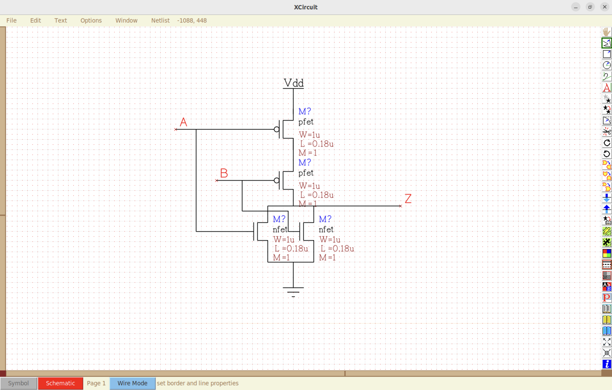
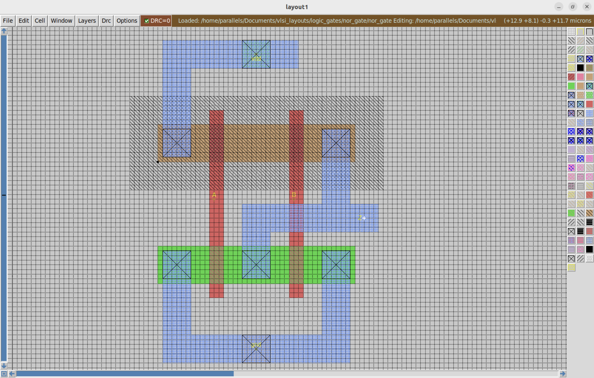
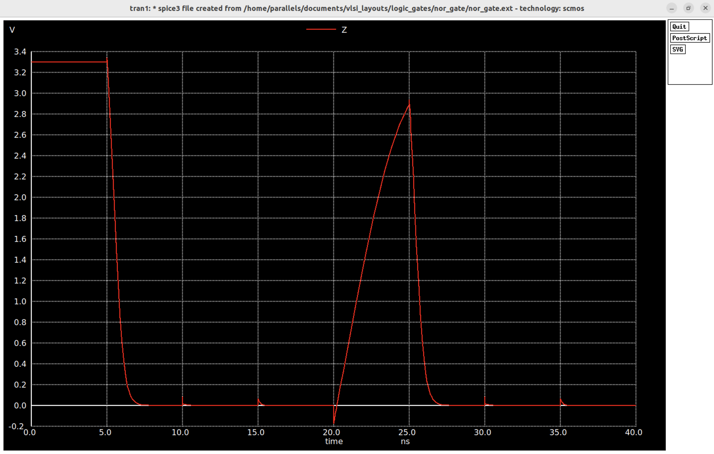

# 🔲 CMOS NOR Gate — Full Custom Design

This project implements a **CMOS NOR gate** using a full custom flow:  
From schematic capture in Xcircuit, layout in Magic VLSI, and simulation using ngspice (with parasitic extraction).

---

## 🧠 Logic Behavior

Like the NAND gate, the NOR gate is also a universal logic gate — all digital systems can also be built using only NORs. 
Its behavior is defined by the following truth table:

| A | B | Output |
|---|---|--------|
| 0 | 0 | 1      |
| 0 | 1 | 0      |
| 1 | 0 | 0      |
| 1 | 1 | 0      |

---

## 🔧 Transistor-Level Schematic

  

<em>CMOS schematic captured in Xcircuit</em>

---

## 🧱 Layout in Magic VLSI

  

<em>Full custom layout using Magic VLSI</em>

---

## 🧪 Transient Simulation with ngspice

### 🔹 Input Waveforms

  

### 🔹 Output Waveform (with parasitics)

  

The output node `Z` transitions high only when both `A` and `B` are low — matching NOR behavior.  
Parasitic capacitance extracted from layout (via `ext2spice`) was preserved to reflect real-world electrical effects.

---

## 📁 Files in This Project

| File               | Description                             |
|--------------------|-----------------------------------------|
| `NOR_Schematic.png` | Transistor-level schematic (Xcircuit)  |
| `NOR_Layout.png`    | Magic VLSI layout                      |
| `NOR_Output.png`    | Simulated output waveform              |
| `nor_gate.spice`    | SPICE netlist with extracted parasitics|
| `README.md`         | This documentation                     |

---

## ✅ Next Steps

- [ ] Implement a 2-input OR gate
- [ ] Implement a 2-input AND gate

