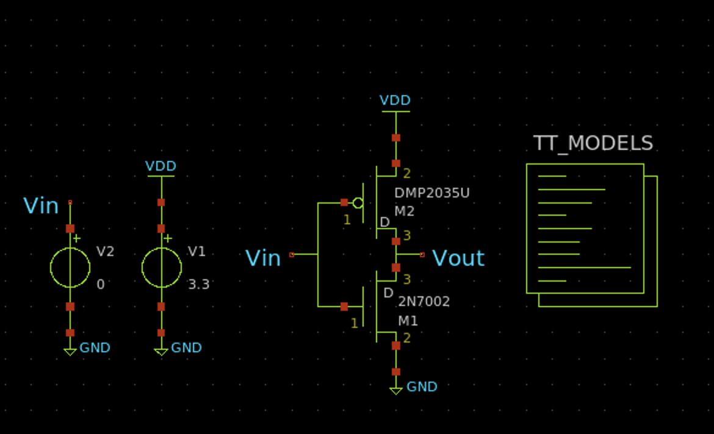
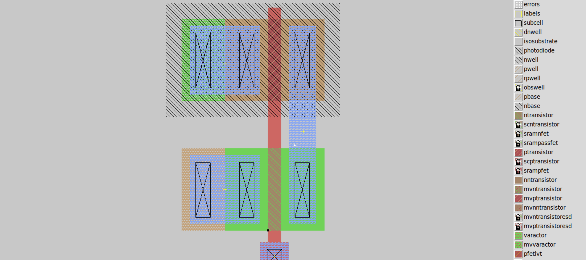

# 🔲 Logic Gates — CMOS VLSI (Full Custom)

This `combinational` repository contains full-custom layouts and simulations of basic logic gates: `NOT`, `NAND`, `NOR`, 
`AND`, `OR`, `XOR`, and a simple `2:1 multiplexer`.

Each gate has its own folder with:
- Custom layout in Magic VLSI
- Schematic in Xschem
- LVS checks with Netgen
- SPICE simulation using ngspice
- Parasitic-aware analysis

---

## 🛠 Tools Used

| Tool        | Purpose                                 |
|-------------|-----------------------------------------|
| Magic VLSI  | Physical layout and netlist extraction  |
| ngspice     | Transient simulation of SPICE netlists  |
| Xschem      | Schematic capture and SPICE export      |
| netgen      | LVS comparison between layout and schematic |

---


---

## 🧠 Theory: Static CMOS Logic

In static CMOS logic, any function can be implemented using a pull-up network (PUN) and a pull-down network (PDN). Each consists of PMOS and NMOS transistors arranged complementarily.

This ensures:
- Output is always connected to either VDD or GND
- No direct current path between power and ground
- Low static power dissipation
- High noise margins and fast switching

---

## 💡 Example: NAND Gate

### Transistor-Level Schematic

<p align="center">
  
</p>
<p align="center"><em>2-input NAND schematic (Xschem)</em></p>

### Layout (Magic VLSI)

<p align="center">
  
</p>
<p align="center"><em>Magic VLSI layout (with DRC clean)</em></p>

---

## 🧪 Simulation: Spice Models

Simulation uses BSIM3 Level-49 models from the SCMOS `ami05` 0.5µm process.

```spice
.model nfet NMOS (LEVEL=49 VTH0=0.71 U0=533 ...)
.model pfet PMOS (LEVEL=49 VTH0=-0.92 U0=202 ...)
```
---

## ✅ Takeaways
- Learned how to extract parasitics and simulate post-layout
- Understand layouts of basic logic gates

---

## 🚀 Next Steps
- Design memory circuits (D flip-flop, D latch) using Xcircuit and Magic
- Design, build, and test a ring oscillator. Analyze the frequency and the propagation delay of the inverter
- Apply the layout of logic gates to larger circuits like multiplexers, adders, and ALU's.

---

## 🙌 Closing Notes
This repo is for students, researchers, and hobbyists learning VLSI using open tools.
Feel free to fork, open issues, or contribute new gate implementations!

---
