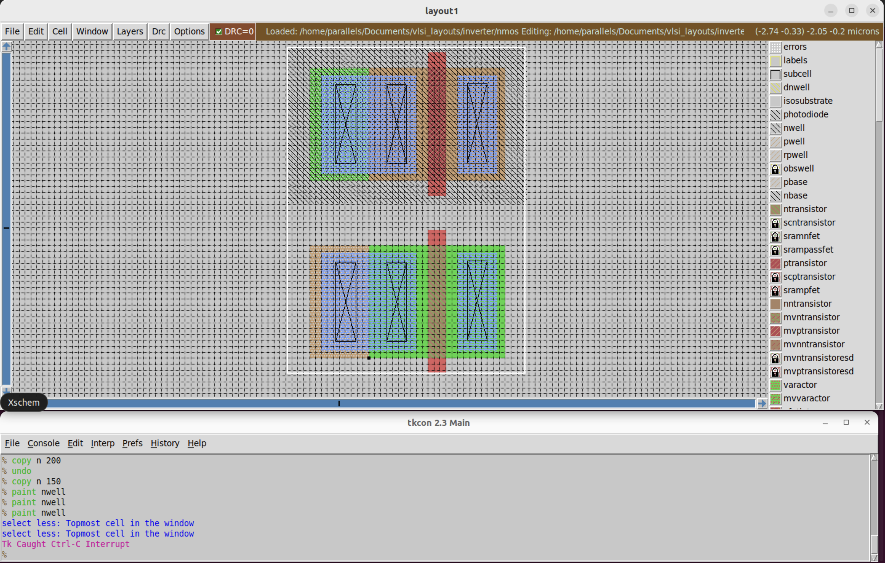
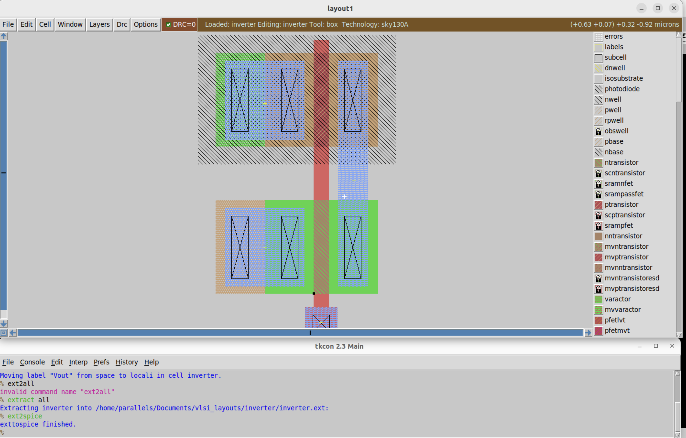
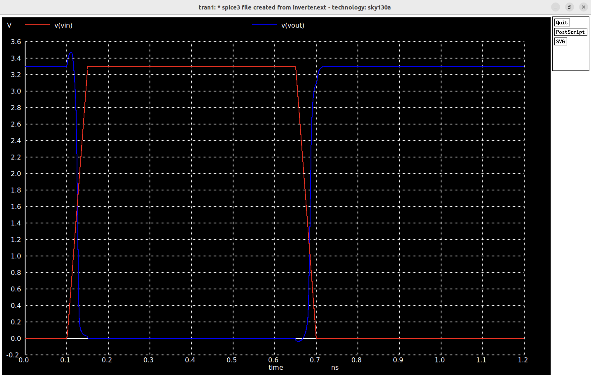

# CMOS Inverter

As the "Hello World" of CMOS VLSI design, this project implements an **inverter** using open-source tools. It demonstrates a full-custom flow, from schematic capture and simulation to layout and layout-vs-schematic (LVS) verification.

The goal is to explore basic CMOS behavior and get familiar with digital custom design flows using open tools — similar to those used in industry and academia.

---
### 🔧 Tools Used
<div align="center">
  <table>
    <tr>
      <th>Tool</th>
      <th>Purpose</th>
    </tr>
    <tr>
      <td>Magic VLSI</td>
      <td>Physical layout and netlist extraction</td>
    </tr>
    <tr>
      <td>ngspice</td>
      <td>Transient simulation of SPICE netlist</td>
    </tr>
    <tr>
      <td>Xschem</td>
      <td>Schematic capture and SPICE export</td>
    </tr>
    <tr>
      <td>netgen</td>
      <td>LVS comparison between layout and schematic</td>
    </tr>
  </table>
</div>

---

### 🧠 CMOS Inverter Theory

A CMOS inverter consists of a **PMOS pull-up** and **NMOS pull-down** transistor connected in series between VDD and GND. The gates are tied together as the input, and the drains are tied together as the output.

<div align="center">
  <table>
    <tr>
      <th>Input</th>
      <th>PMOS</th>
      <th>NMOS</th>
      <th>Output</th>
    </tr>
    <tr>
      <td>0</td>
      <td>ON</td>
      <td>OFF</td>
      <td>1</td>
    </tr>
    <tr>
      <td>1</td>
      <td>OFF</td>
      <td>ON</td>
      <td>0</td>
    </tr>
  </table>
</div>


This complementary behavior ensures low static power and fast switching.

---

### Schematic (Xschem)
<div align="center">
  
</div>

Here's a basic schematic of the inverter using Xschem. The netlist button
is green, meaning that it's generated and there are no DRC violations.

### SPICE simulation 

Now we can derive the current SPICE netlist from the schematic and we can drive
the inputs and outputs using ngspice. We will also need this SPICE netlist later
to compare with Magic's extraction for LVS.

```SPICE
** sch_path: /home/parallels/Documents/vlsi_layouts/inverter/xschem/inverter.sch
**.subckt inverter Vdd Vin Vout Vss
*.ipin Vin
*.opin Vout
*.ipin Vdd
*.ipin Vss
XM1 Vout Vin Vdd VDD sky130_fd_pr__pfet_01v8_lvt L=0.35 W=1 nf=1 ad=0.29 as=0.29 pd=2.58 ps=2.58 nrd=0.29 nrs=0.29 sa=0 sb=0 sd=0
+ mult=1 m=1
XM2 Vout Vin Vss GND sky130_fd_pr__nfet_01v8_lvt L=0.15 W=1 nf=1 ad=0.29 as=0.29 pd=2.58 ps=2.58 nrd=0.29 nrs=0.29 sa=0 sb=0 sd=0
+ mult=1 m=1
**.ends
.end
```

---

### 🧱 Layout (Magic VLSI)
First we draw out our N-channel and P-channel MOSFETs while making sure we don't get any DRC checks, such as n-diffusion layers
meeting a minimum width requirement, the N-well needing to have a minimum size around the P-channel MOSFET, etc.

<div align="center">
  
</div>

After making our PMOS and NMOS, we are ready to make our inverter! Based on our inverter schematic, 
if we connect the gates and sources of each respective gate then we can form the inverter.

<div align="center">
  
</div>

- Drawn using n-diffusion, p-diffusion, poly, and metal layers.
- Extracted netlist used for LVS comparison.
- DRC clean.
  
---

### 📐 SPICE Netlist

- Includes a PMOS and NMOS transistor.
- Simulated using ngspice to observe inverter behavior.

```spice

* 0.01um = 10nm for proper scaling
.option scale=0.01u

* import sky130 models
.lib /usr/local/share/pdk/sky130A/libs.tech/ngspice/sky130.lib.spice tt

* power supply
Vdd Vdd 0 3.3

* input pulse
Vin Vin 0 pulse(0 3.3 100p 50p 50p 500p 1200p)

* transistors from ext2spice
* connect gnd to node 0 (ground)
X0 Vout Vin 0 0 sky130_fd_pr__nfet_01v8 ad=4.75n pd=0.29m as=4.75n ps=0.29m w=95 l=15
X1 Vout Vin Vdd Vdd sky130_fd_pr__pfet_01v8 ad=4.75n pd=0.29m as=4.75n ps=0.29m w=95 l=15

* transient analysis
.control
tran 1p 1200p
plot v(Vin) v(Vout)
.endc

.end
```

For more information regarding the transistor models, please check `sky130.lib.spice` to see the 
behavior of their technology node.

---

### 📈 Simulation (ngspice)

<div align="center">
  
</div>

This simulation is done directly on the extracted netlist from Magic VLSI:
- Low input → high output
- High input → low output

The blue waveform is the output while the red waveform is the input pulse, which is acting as expected.
The inverter behaves as expected — producing a clean logic inversion with minimal delay or distortion, even with modestly sized transistors.

---

### Closing Notes

Feel free to reach out or fork this repo if you’re also learning custom chip design using open tools. I hope this helps other students and hobbyists dive into VLSI!

---
