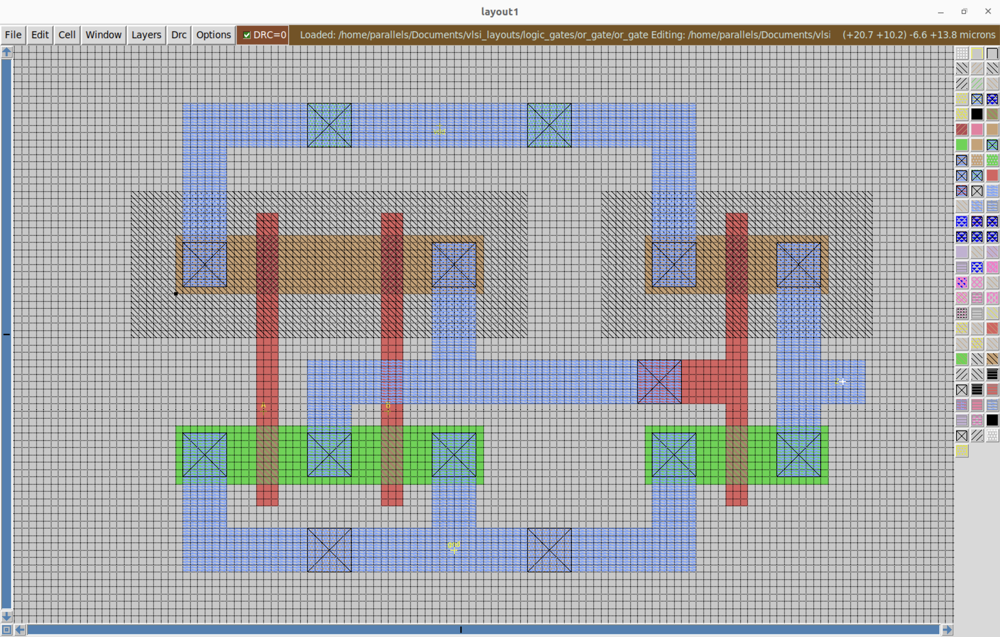
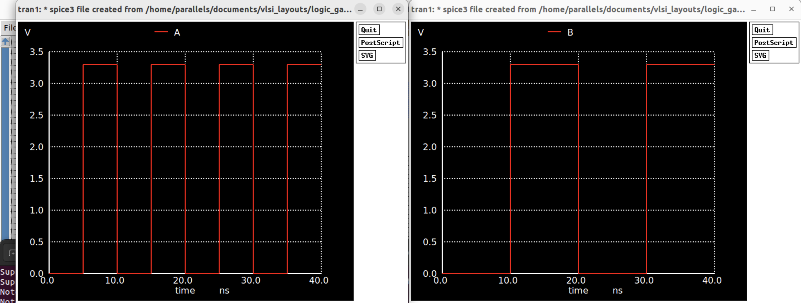

# 🔲 CMOS OR Gate — Full Custom Design

This project implements a **CMOS OR gate** using a full custom flow:  
From schematic capture in Xschem, layout and DRC in Magic VLSI, LVS with netgen, and simulation using ngspice (with parasitic extraction).

---

## 🧠 Logic Behavior

The OR gate is the inverse of the NOR gate, yielding a '1' when either input is high. 
Its behavior is defined by the following truth table:

| A | B | Output |
|---|---|--------|
| 0 | 0 | 0      |
| 0 | 1 | 1      |
| 1 | 0 | 1      |
| 1 | 1 | 1      |

---

## 🔧 Transistor-Level Schematic

  

<em>CMOS schematic captured in Xschem, note that this schematic is just the NOR configuration with its output passed into an inverter.</em>

---

## 🧱 Layout in Magic VLSI

  

<em>Full custom layout using Magic VLSI.</em>

---

## 🧪 Transient Simulation with ngspice

### 🔹 Input Waveforms

  

### 🔹 Output Waveform (with parasitics)

  

The output node `Z` transitions low only when both `A` and `B` are both low — matching OR behavior.  
Parasitic capacitance extracted from layout (via `ext2spice`) was preserved to reflect real-world electrical effects.

---

## 📁 Files in This Project

| File               | Description                             |
|--------------------|-----------------------------------------|
| `or_schematic.png` | Transistor-level schematic (Xschem  )  |
| `or_layout.png`    | Magic VLSI layout                      |
| `or_output.png`    | Simulated output waveform              |
| `or_gate.spice`    | SPICE netlist with extracted parasitics|
| `README.md`         | This documentation                    |

---

